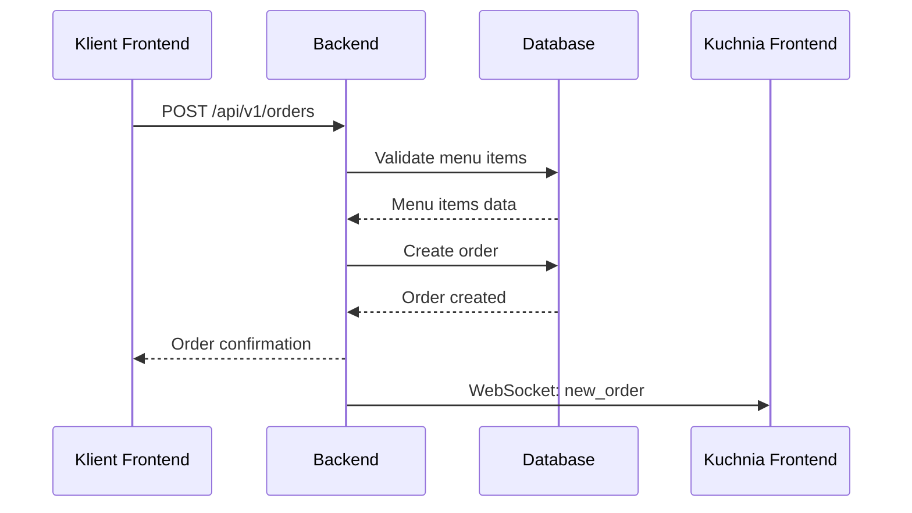
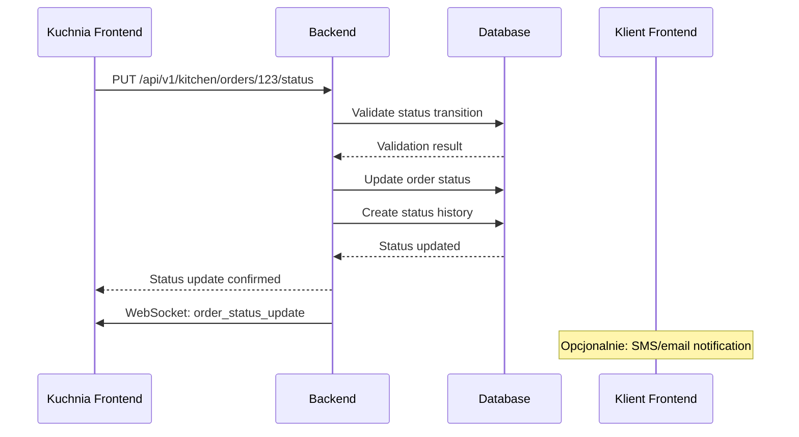
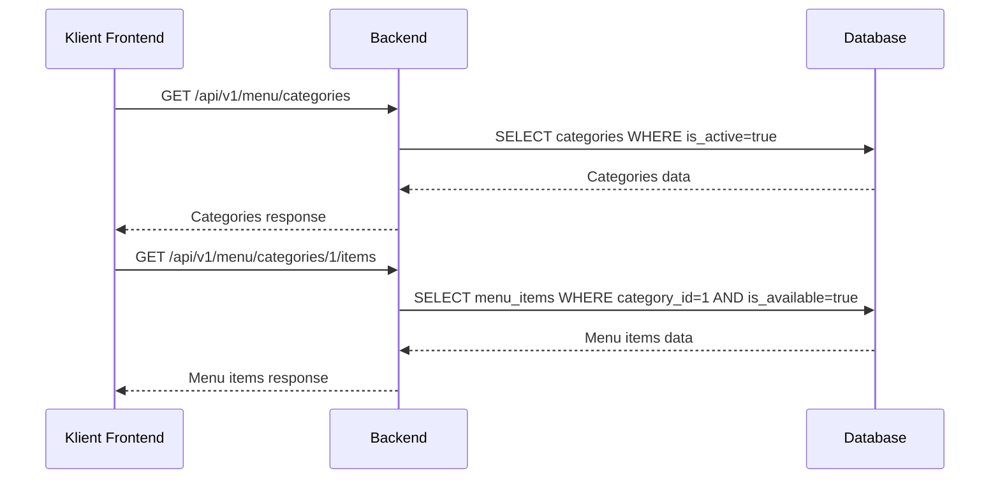

# Komunikacja Między Aplikacjami

## 1. Przegląd Komunikacji

System restauracji składa się z 4 komponentów komunikujących się ze sobą:

```
┌─────────────────┐    ┌─────────────────┐
│  Frontend       │    │  Frontend       │
│  Klienta        │    │  Kuchni         │
│  (React)        │    │  (React)        │
│  Port: 3000     │    │  Port: 3001     │
└─────────┬───────┘    └─────────┬───────┘
          │                      │
          │    HTTP REST API     │ HTTP REST API
          │    WebSocket         │ WebSocket
          │                      │
          └──────┬─────────────────┘
                 │
         ┌───────▼────────┐
         │   Backend      │
         │   Server       │
         │   (Go/Gin)     │
         │   Port: 8080   │
         └───────┬────────┘
                 │
                 │ SQL/TCP
                 │
         ┌───────▼────────┐
         │  PostgreSQL    │
         │  Database      │
         │  Port: 5432    │
         └────────────────┘
```

## 2. Protokoły Komunikacji

### 2.1 HTTP REST API
**Zastosowanie**: Główna komunikacja między frontendami a backendem
- **Protokół**: HTTP/1.1, HTTPS (w produkcji)
- **Format danych**: JSON
- **Content-Type**: `application/json`
- **Encoding**: UTF-8

### 2.2 WebSocket
**Zastosowanie**: Aktualizacje w czasie rzeczywistym dla kuchni
- **Protokół**: WebSocket (ws://, wss:// w produkcji)
- **Format wiadomości**: JSON
- **Typ połączenia**: Full-duplex

### 2.3 SQL/TCP
**Zastosowanie**: Komunikacja backend ↔ baza danych
- **Protokół**: PostgreSQL Wire Protocol
- **Port**: 5432
- **SSL**: TLS w produkcji

## 3. API Endpoints

### 3.1 Menu Management
```
GET    /api/v1/menu/categories              # Lista kategorii
GET    /api/v1/menu/categories/:id          # Szczegóły kategorii
GET    /api/v1/menu/categories/:id/items    # Pozycje w kategorii
GET    /api/v1/menu/items/:id               # Szczegóły pozycji menu
```

**Przykład Response - Lista kategorii:**
```json
{
  "success": true,
  "message": "Categories retrieved successfully",
  "data": [
    {
      "id": 1,
      "name": "Wrapy",
      "description": "Świeże wrapy z różnymi nadzieniami",
      "imageUrl": "/images/categories/wrapy.jpg",
      "displayOrder": 1,
      "isActive": true
    }
  ]
}
```

**Przykład Response - Pozycje w kategorii:**
```json
{
  "success": true,
  "message": "Menu items retrieved successfully",
  "data": [
    {
      "id": 1,
      "categoryId": 1,
      "name": "Wrap Klasyczny",
      "description": "Kurczak, sałata, pomidor, ogórek, sos czosnkowy",
      "price": 18.00,
      "imageUrl": "/images/items/wrap-klasyczny.jpg",
      "isAvailable": true,
      "preparationTime": 10,
      "allergens": ["gluten"],
      "isVegetarian": false,
      "isVegan": false,
      "isSpicy": false
    }
  ]
}
```

### 3.2 Order Management
```
POST   /api/v1/orders                       # Utworzenie zamówienia
GET    /api/v1/orders/:id                   # Szczegóły zamówienia
GET    /api/v1/orders/number/:orderNumber   # Zamówienie po numerze
PUT    /api/v1/orders/:id/status            # Aktualizacja statusu
```

**Przykład Request - Utworzenie zamówienia:**
```json
{
  "customerName": "Jan Kowalski",
  "customerPhone": "123456789",
  "notes": "Bez cebuli",
  "items": [
    {
      "menuItemId": 1,
      "quantity": 2,
      "specialRequests": "Dodatkowy sos"
    },
    {
      "menuItemId": 3,
      "quantity": 1,
      "specialRequests": ""
    }
  ]
}
```

**Przykład Response - Utworzone zamówienie:**
```json
{
  "success": true,
  "message": "Order created successfully",
  "data": {
    "id": 123,
    "orderNumber": "ORD-20250729-001",
    "customerName": "Jan Kowalski",
    "customerPhone": "123456789",
    "totalAmount": 55.00,
    "status": "pending",
    "notes": "Bez cebuli",
    "estimatedReadyTime": "2025-07-29T14:25:00Z",
    "createdAt": "2025-07-29T14:10:00Z",
    "items": [
      {
        "id": 1,
        "menuItemId": 1,
        "quantity": 2,
        "unitPrice": 18.00,
        "totalPrice": 36.00,
        "specialRequests": "Dodatkowy sos",
        "menuItem": {
          "id": 1,
          "name": "Wrap Klasyczny"
        }
      }
    ]
  }
}
```

**Przykład Request - Aktualizacja statusu:**
```json
{
  "status": "in_progress"
}
```

### 3.3 Kitchen Management
```
GET    /api/v1/kitchen/orders               # Lista zamówień dla kuchni
GET    /api/v1/kitchen/metrics              # Metryki kuchni
PUT    /api/v1/kitchen/orders/:id/status    # Aktualizacja statusu (kuchnia)
```

**Przykład Response - Lista zamówień kuchni:**
```json
{
  "success": true,
  "message": "Kitchen orders retrieved successfully",
  "data": [
    {
      "id": 123,
      "orderNumber": "ORD-20250729-001",
      "customerName": "Jan Kowalski",
      "totalAmount": 55.00,
      "status": "pending",
      "estimatedReadyTime": "2025-07-29T14:25:00Z",
      "createdAt": "2025-07-29T14:10:00Z",
      "items": [
        {
          "id": 1,
          "quantity": 2,
          "specialRequests": "Dodatkowy sos",
          "menuItem": {
            "name": "Wrap Klasyczny",
            "preparationTime": 10
          }
        }
      ]
    }
  ]
}
```

## 4. WebSocket Komunikacja

### 4.1 Połączenie WebSocket
```javascript
// Frontend Kuchni
const ws = new WebSocket('ws://localhost:8080/ws/kitchen?clientId=kitchen-1');

ws.onopen = function(event) {
    console.log('Connected to kitchen WebSocket');
};

ws.onmessage = function(event) {
    const message = JSON.parse(event.data);
    handleWebSocketMessage(message);
};

ws.onclose = function(event) {
    console.log('Disconnected from WebSocket');
    // Implement reconnection logic
};
```

### 4.2 Typy Wiadomości WebSocket

**Nowe zamówienie:**
```json
{
  "type": "new_order",
  "payload": {
    "id": 123,
    "orderNumber": "ORD-20250729-001",
    "customerName": "Jan Kowalski",
    "totalAmount": 55.00,
    "status": "pending",
    "items": [...]
  }
}
```

**Aktualizacja statusu zamówienia:**
```json
{
  "type": "order_status_update",
  "payload": {
    "id": 123,
    "orderNumber": "ORD-20250729-001",
    "oldStatus": "pending",
    "newStatus": "in_progress",
    "updatedAt": "2025-07-29T14:15:00Z"
  }
}
```

**Pilne zamówienie:**
```json
{
  "type": "urgent_order",
  "payload": {
    "id": 123,
    "orderNumber": "ORD-20250729-001",
    "timeElapsed": 1800,
    "estimatedTime": 900
  }
}
```

## 5. Error Handling

### 5.1 HTTP Error Responses
```json
{
  "success": false,
  "message": "Validation failed",
  "error": "Customer name is required",
  "errors": [
    {
      "field": "customerName",
      "message": "This field is required"
    },
    {
      "field": "items",
      "message": "At least one item is required"
    }
  ]
}
```

### 5.2 HTTP Status Codes
- `200 OK` - Sukces
- `201 Created` - Zasób utworzony
- `400 Bad Request` - Błędne dane wejściowe
- `401 Unauthorized` - Brak autoryzacji
- `403 Forbidden` - Brak uprawnień
- `404 Not Found` - Zasób nie znaleziony
- `409 Conflict` - Konflikt (np. nieprawidłowa zmiana statusu)
- `422 Unprocessable Entity` - Błędne dane biznesowe
- `500 Internal Server Error` - Błąd serwera

### 5.3 WebSocket Error Handling
```json
{
  "type": "error",
  "payload": {
    "code": "CONNECTION_ERROR",
    "message": "Failed to process message",
    "timestamp": "2025-07-29T14:15:00Z"
  }
}
```

## 6. Przepływy Komunikacji

### 6.1 Składanie Zamówienia (Frontend Klient → Backend)


### 6.2 Aktualizacja Statusu Zamówienia (Kuchnia → Backend)


### 6.3 Pobranie Menu (Frontend Klient → Backend)


## 7. Konfiguracja CORS

### 7.1 Backend CORS Settings
```go
// internal/api/middleware/cors.go
func CORS() gin.HandlerFunc {
    return gin.HandlerFunc(func(c *gin.Context) {
        origin := c.Request.Header.Get("Origin")
        
        // Allowed origins
        allowedOrigins := []string{
            "http://localhost:3000", // Frontend Klient
            "http://localhost:3001", // Frontend Kuchnia
        }
        
        for _, allowedOrigin := range allowedOrigins {
            if origin == allowedOrigin {
                c.Header("Access-Control-Allow-Origin", origin)
                break
            }
        }
        
        c.Header("Access-Control-Allow-Methods", "GET, POST, PUT, DELETE, OPTIONS")
        c.Header("Access-Control-Allow-Headers", "Content-Type, Authorization")
        c.Header("Access-Control-Allow-Credentials", "true")
        c.Header("Access-Control-Max-Age", "86400")
        
        if c.Request.Method == "OPTIONS" {
            c.AbortWithStatus(204)
            return
        }
        
        c.Next()
    })
}
```

## 8. Rate Limiting

### 8.1 API Rate Limits
```go
// Rate limits per endpoint
var rateLimits = map[string]int{
    "POST /api/v1/orders":        10,  // 10 orders per minute
    "GET /api/v1/menu/*":         100, // 100 requests per minute
    "PUT /api/v1/orders/*/status": 30,  // 30 status updates per minute
}
```

## 9. Monitoring i Logging

### 9.1 Request Logging
```go
// internal/api/middleware/logger.go
func Logger() gin.HandlerFunc {
    return gin.HandlerFunc(func(c *gin.Context) {
        start := time.Now()
        path := c.Request.URL.Path
        method := c.Request.Method
        
        c.Next()
        
        latency := time.Since(start)
        status := c.Writer.Status()
        
        log.Printf("[%s] %s %s - %d - %v",
            method, path, c.ClientIP(), status, latency)
    })
}
```

### 9.2 WebSocket Connection Monitoring
```go
// Monitor WebSocket connections
func (h *Hub) GetStats() map[string]interface{} {
    h.mutex.RLock()
    defer h.mutex.RUnlock()
    
    return map[string]interface{}{
        "active_connections": len(h.clients),
        "total_messages_sent": h.messagesSent,
        "uptime": time.Since(h.startTime),
    }
}
```

## 10. Security

### 10.1 Input Validation
```go
// Validation tags w strukturach
type CreateOrderRequest struct {
    CustomerName  string `json:"customerName" validate:"required,min=2,max=50"`
    CustomerPhone string `json:"customerPhone" validate:"required,phone"`
    Items         []CreateOrderItemRequest `json:"items" validate:"required,min=1,max=20"`
}
```

### 10.2 SQL Injection Prevention
- Użycie GORM ORM zapobiega SQL injection
- Wszystkie zapytania są parametryzowane
- Walidacja input'ów na poziomie API

### 10.3 XSS Prevention
- Escapowanie HTML w response'ach
- Content Security Policy headers
- Sanityzacja danych wejściowych

## 11. Performance Optimizations

### 11.1 Database Connection Pooling
```go
// Database configuration
func setupDatabase() *gorm.DB {
    sqlDB, err := sql.Open("postgres", dsn)
    if err != nil {
        log.Fatal("Failed to connect to database:", err)
    }
    
    sqlDB.SetMaxOpenConns(25)
    sqlDB.SetMaxIdleConns(5)
    sqlDB.SetConnMaxLifetime(time.Hour)
    
    gormDB, err := gorm.Open(postgres.New(postgres.Config{
        Conn: sqlDB,
    }), &gorm.Config{})
    
    return gormDB
}
```

### 11.2 Caching Strategy
- HTTP caching headers dla statycznych danych (menu)
- In-memory cache dla często pobieranych danych
- Redis cache w przyszłości dla skalowalności

### 11.3 Pagination
```go
// Pagination dla dużych list
type PaginationParams struct {
    Page     int `json:"page" form:"page" validate:"min=1"`
    PageSize int `json:"pageSize" form:"pageSize" validate:"min=1,max=100"`
}

type PaginatedResponse struct {
    Data       interface{} `json:"data"`
    TotalCount int64       `json:"totalCount"`
    Page       int         `json:"page"`
    PageSize   int         `json:"pageSize"`
    TotalPages int         `json:"totalPages"`
}
```
